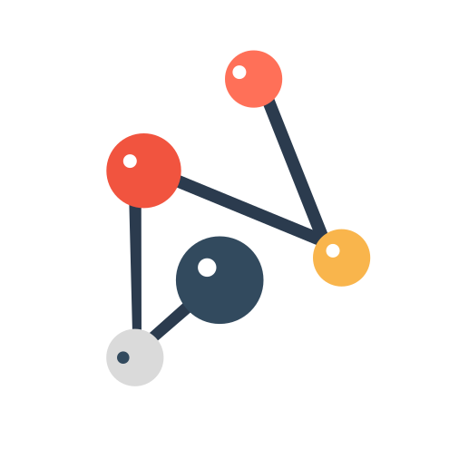

# neuron

neuron is a **future-proof** command-line app for managing your plain-text [Zettelkasten](https://neuron.zettel.page/zettelkasten.html) notes.

**Highlights**

- Work with a directory of markdown files
- Powerful linking syntax and hierarchical tagging
- Auto-generated static web site (see [examples](https://neuron.zettel.page/examples.html))
- Simple to use, with optional editor integration ([emacs, vim, vscode, etc.](https://neuron.zettel.page/editor.html))

## Getting started

See [neuron.zettel.page](https://neuron.zettel.page/) for the full guide to installing and using neuron, as well as for other resources.

## Developing

Development documentation, including instructions to install from source, is available in [CONTRIBUTING.md](https://github.com/srid/neuron/blob/master/CONTRIBUTING.md).
