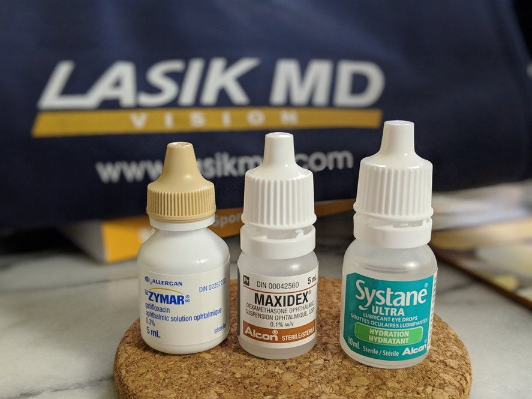

On March 14th 2019 I had **Custom Wavefront LASIK** surgery done on both the
eyes to correct _simple myopia_ with _astigmatism_ that I have had since as a
teenager.

These are my **ongoing** notes on the procedure and the healing experience
\(which is expected to take 6 months\).

## Initial evaluation

I chose to get my surgery done at [_LASIK MD_](https://www.lasikmd.com) center
in Quebec. I was asked to sleep without my contacts \(I could wear them during
the day\) for a week before the day of evaluation wherein they would ascertain
whether I'm a candidate for LASIK and if so for what kind of surgery.

The entire evaluation took about 3 hours. My vision has already been stable
during the last few years. I was told that custom wavefront LASIK would be the
best choice, even though standard LASIK is an option. The later allows me to
return within the next 3 years for a vision correction, whereas the duration for
the former is the entire lifetime \(however the cornea thickness will limit the
number of touch ups\). Custom wavefront LASIK is supposed to result in better
vision, so I went with that.

## Day of surgery

I continued to sleep without contacts until the day of surgery. The whole
appointment took about 4 hours overall even though the surgery itself must have
taken about 10 minutes. Feeling your eyes being "cut" and "peeled" \([flap
creation](https://en.wikipedia.org/wiki/LASIK#Flap_creation)\) is quite an
experience. Although I "felt" only a slight anxiety my body was physically left
shaking for a few minutes after the surgery.

I was given three eye drops---anti-bacterial, anti-inflammatory and hydrating---to be used for the initial 5 days, after which I was to continue using the
hydrating drops on an as-needed basis.

On the day surgery I was asked to,

* keep the eyes closed as much as possible
* wear the provided sunglasses all time indoors \(and outdoors\)
* no shower or bathing
* no looking at phone or computer; and no reading

For the subsequent three days I was to wear the sunglasses outdoors,
but not necessarily indoors and I could take a shower as long as I prevent
water or soap from getting to the eyes \(I showered with eyes closed\).

## Day after surgery

I had about `-4.00` diopters on both eyes, which after surgery got corrected to
`-0.25` on the the right eye and `-0.75` on the left \(vision is supposed to
continue to improve as the eyes heal over the months\) which is reportedly
better than average results on day 2. Although the left eye had a noticeably
fuzzier vision on its own than the right eye, with both eyes open my vision was
near-perfect. Overall my vision is already as good as that of wearing contact
lens!

## Week after surgery

The vision on the left eye has started improving, and I'm looking forward to the
new measurements to be ascertained during the 2-week appointment.

I'm still using hydrating eye drops frequently as soon as I notice the eyes
becoming dry.

## Two weeks

I had a follow-up check up 2 weeks post-surgery. By this time my vision had
noticeably improved and the left eye is almost on par with the right eye. The
measurements this time are: `-0.25` on both the eyes.

## Four months+

After around 4 months I stopped using hydrating drops on regular basis (use them
only when needed, which is rare).
